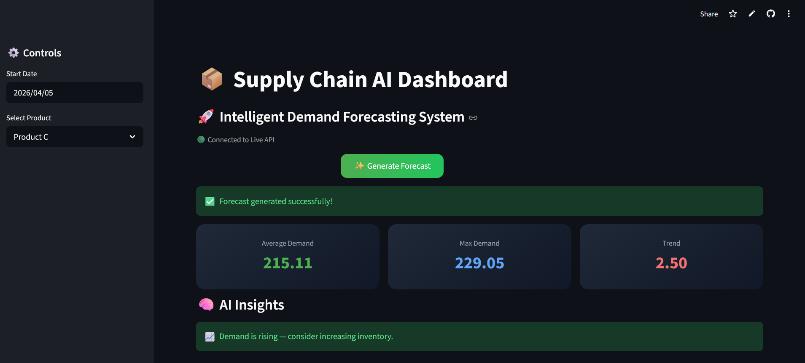
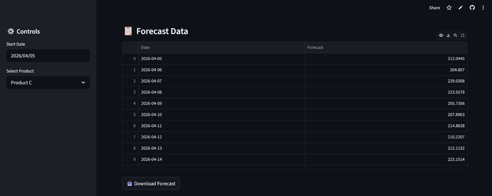
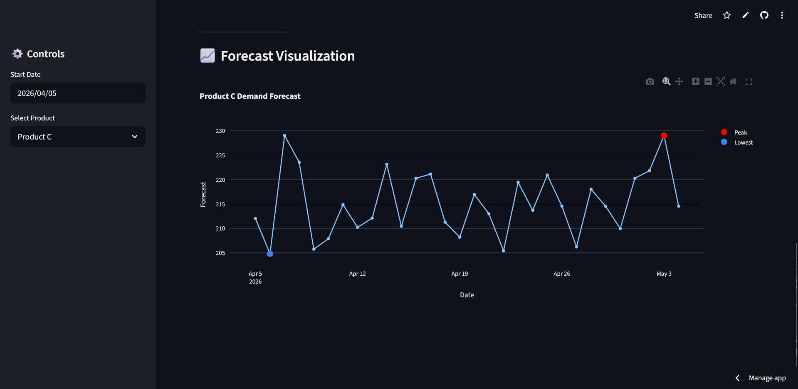

# 📦 AI-Powered Supply Chain Forecasting System

🚀 A production-grade full-stack machine learning system for real-time demand forecasting with an interactive analytics dashboard.

---

## 🌐 Live Demo

- 🔗 **Frontend (Dashboard):**  
  https://supply-chain-optimization-x7.streamlit.app  

- ⚡ **Backend API:**  
  https://supply-chain-api-zssg.onrender.com  

---

## 🧠 Why This Project?

Supply chain inefficiencies cost companies billions annually due to:

- 📦 Overstocking  
- 📉 Understocking  
- ❌ Inaccurate demand predictions  

This project solves this problem using a real-time ML-powered forecasting system.

---

## ✨ Key Features

- Full-stack ML system (Model + API + UI)  
- Real-time forecasting pipeline  
- Hybrid intelligent modeling (ARIMA + fallback logic)  
- Interactive dashboard with business insights  
- Production-ready architecture (model caching, API design)  

---

## 🏗️ Architecture
Streamlit UI (Frontend)

↓

FastAPI Backend (Render)

↓

ML Engine (ARIMA + Hybrid Model)

↓

Forecast Output + Insights


---

## 🤖 Machine Learning Approach

- Time-series forecasting using **ARIMA**
- Intelligent hybrid system:
  - High data → ARIMA  
  - Low variation → Smoothed model  
  - Sparse data → Fallback logic  
- Dynamic forecasting using controlled variation  

---

## 📊 Dashboard Preview

### 📌 Main Dashboard


---

### 📋 Forecast Table


---

### 📈 Forecast Visualization


---

## ⚡ Performance Optimization

- Model caching at startup (no retraining per request)  
- Fast API response (milliseconds)  
- Optimized forecasting pipeline  

---

## 🛠 Tech Stack

**Backend**
- Python  
- FastAPI  
- Statsmodels (ARIMA)  
- Pandas, NumPy  

**Frontend**
- Streamlit  
- Plotly  

**Deployment**
- Render  
- Streamlit Cloud  
- GitHub  


---

## 🚀 Run Locally

```bash
git clone https://github.com/your-username/supply-chain-optimization.git
cd supply-chain-optimization
pip install -r requirements.txt
uvicorn main:app --reload
```
## Frontend:
```bash
cd frontend
streamlit run app.py
```
---
## 💼 Resume Impact

Built and deployed a full-stack ML forecasting system with real-time API integration, enabling interactive demand analysis and reducing response latency through model caching.

---
## 🔮 Future Improvements

 Multi-product comparison dashboard
 
 Database integration (PostgreSQL)
 
 Automated retraining pipeline
 
 Authentication system
 
 Custom domain

---

## 👨‍💻 Author

Arindam Karmakar

GitHub: https://github.com/Arindam-Neel-X7

Linkedin: https://linkedin.com/in/arindamkarmakarx

---

## ⭐ Support

If you found this useful, consider giving it a ⭐ on GitHub!

